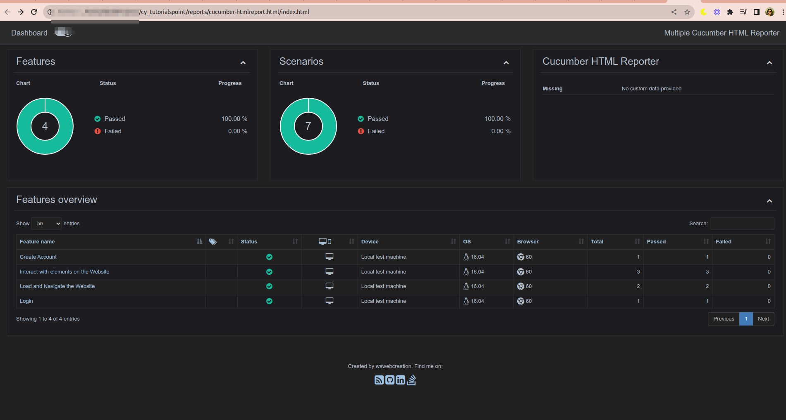

# Automated Web Testing with Cypress, Cucumber, and JavaScript

This repository contains an automated web testing project that interacts with the Tutorialspoint website using Cypress, Cucumber, and JavaScript. The project aims to demonstrate how to perform end-to-end testing of web applications and ensure their functionality, reliability, and user-friendliness.

## Pre-requisites

To get started with this project, you'll need to have the following prerequisites installed on your machine:

1. Node JS: I recommend using version 16.14.2 or newer.
2. Json-formatter for Native Reporter option(depends on your OS: https://github.com/cucumber/json-formatter)

## Getting Started

Install project dependencies.

```
npm i
```

## Running Tests

You can run the automated tests by using the following command:

1. Run test

```
npm test
```

2. Native report

- Install [cucumber-formatter](https://github.com/cucumber/json-formatter)
- Run test
- Put in console: `node cucumber-html-report.js`
- Open the html-report.html

Results you should see


## Contributions

I welcome contributions to enhance the capabilities and coverage of my automated tests. Please feel free to submit pull requests or report issues if you encounter any problems.

## Contact

If you have any questions or have feedback, please don't hesitate to reach out to me at dbquiroga.day@gmail.com.

---

Thank you for exploring my automated web testing project! Happy testing! 🚀
